# webpack的基本使用

注意：以下操作是基于你已经安装了node的情况下进行的。

##　 一、首先全局安装 webpack、webpack-cli、webpack-dev-server。

在DOS系统也就是磁盘操作系统（即：命令行工具）输入以下命令，进行安装：

```
npm install webpack webpack-cli webpack-dev-server -g
```

## 二、利用DOS系统开始创建项目

1、创建项目根目录

```
mkdir study_webpack
```

2、进行项目根目录，并创建config、dist、src三个文件夹

```
进入项目根目录
cd study_webpack

创建文件夹
mkdir config dist src

```

3、分别在dist和src文件夹下创建一个index.html文件和index.js文件

```
type nul>dist/index.html nul>src/index.js
```

以上步骤运行结果如下图：


## 三、开始使用webpack

1、初始化package.json配置文件

```
npm init -y  //-y：表示按默认值创建package.json文件
```

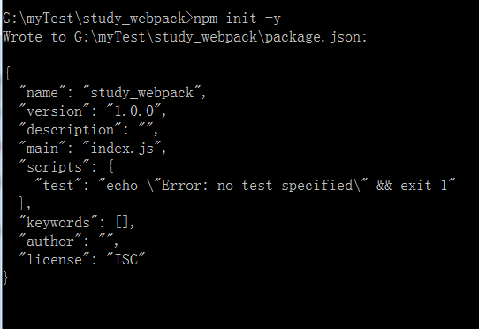

package.json文件里面的内容是最初的样子

```
{
  "name": "study_webpack",
  "version": "1.0.0",
  "description": "",
  "main": "index.js",
  "scripts": {
    "test": "echo \"Error: no test specified\" && exit 1"
  },
  "keywords": [],
  "author": "",
  "license": "ISC"
}

```

此时我们的项目结构如下图：


2、webpack4.x中打包默认找src/index.js作为默认入口，可以直接在Dos中输入
命令webpack 将当前的内容进行一个简答的打包

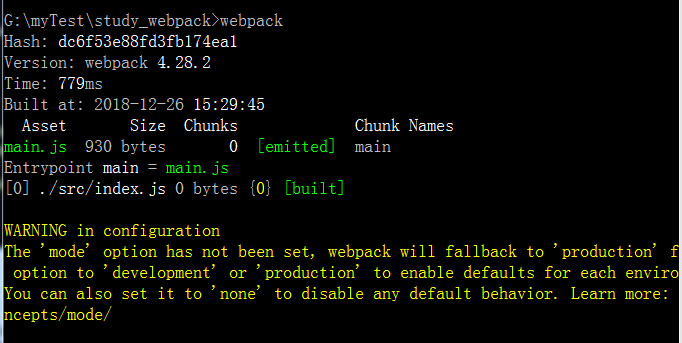

这时候你可以看到项目中的dist文件夹下多了一个main.js文件

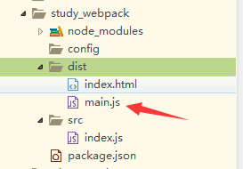

3、细心的小伙伴应该看到打包的时候终端中会出现黄色的警告提示


mode是webpack中独有的，有两种打包环境，一个是开发环境：development，另外一个是生产环境：production
开发环境模式未压缩文件，生产环境模式生产的是压缩后的文件

打包的时候输入webpack --mode=development或者webpack --mode=production就不会出现警告提示了

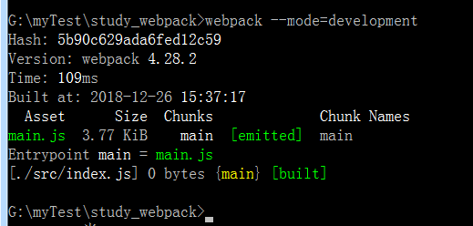

同时可以看到项目文件夹下面多了一个node_modules文件夹

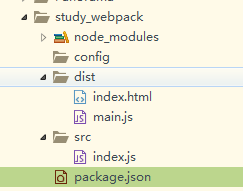


## 三、自己配置一些简单的打包方式

1、在config文件夹中创建webpack.dev.js文件

```
type nul>config/webpack.dev.js
```

此时项目结构如下：

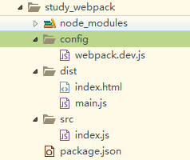

2、移除掉dist文件夹下的main.js和src下的index.js文件，然后我们自己来配置

```
del src\index.js dist\main.js
```

项目结构如下：

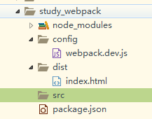

3、现在在src文件夹下面创建main.js文件

```
type nul>src/main.js
```
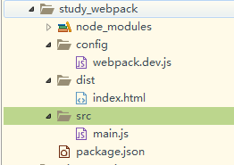

4、进入到webpack.dev.js文件中进行配置，具体在代码中注释

```js
const path = require('path');
module.exports = {
	mode:'development',
	//入口文件配置项
	entry:{
		//这里的mian是可以自定义的，即上面那个步骤中创建的js文件
		main:'./src/main.js'
	},
	//出口文件配置
	output:{
		//打包的路径
		path:path.resolve(__dirname,'../dist'),
		//打包的文件名称
		filename:'bundle.js'
	},
	//模块：录入解读css，图片如何转换，压缩
	module:{},
	//插件，用于生产模板和各项功能
	plugins:[],
	//配置webpack开发服务功能
	devServer:{}
}
```

4.1、现在不能执行之前的webpack --mode="development"命令了会报下面的错误

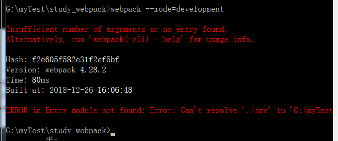

这里是因为webpack4打包默认找的src下面的index.js入口，我们前面已经删除了，这里src下面死main.js文件，
所以找不到就报ERROR in Entry module not found: Error: Can't resolve './src' in '/Users/yubo/Desktop/www/study_webpack2'错误，
所以这里我们到packsge.json里面配置下命令，让打包的时候执行我们在config/webpack.dev.js下面配置的入口。

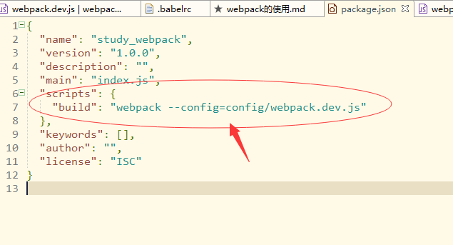

这个时候我们在DOS中输入命令 npm run build就可以了

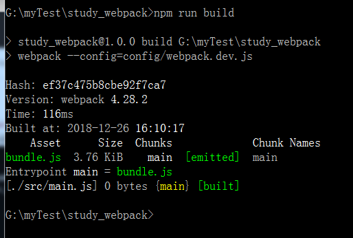

打包后我们可以看到在dist文件夹下多了一个bundle.js文件

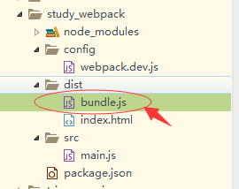

5、上面打包只有一个入口文件，那当我们有多个入口文件的时候那怎么办呢？
比如我们再在src文件夹下新建一个入口文件main2.js

```
type nul>src/main2.js
```

此时我们只需要在刚才的webpack.dev.js中的入口配置项中增加一个入口文件,
在出口文件配置项中的文件名改成：[name].js即可

```js
//入口文件配置项
entry:{
	//这里的mian是可以自定义的，即上面那个步骤中创建的js文件
	main:'./src/main.js',
	main2:'./src/main2.js'
},
//出口文件配置
output:{
	//打包的路径
	path:path.resolve(__dirname,'../dist'),
	//打包的文件名称
	filename:'[name].js' //这里的[name]是告诉我们入口文件是什么名字，打包后也同样是什么名字
}
```

此时我们再次执行npm run build命令来看看

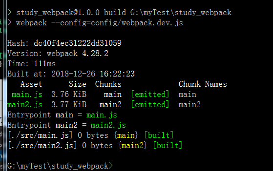

已经打包好了，这个时候看下出口文件dist下面也打包生成了两个相同入口名字的文件

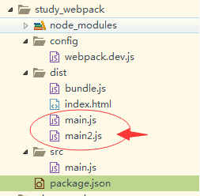

我们可以通过 del dist\bundle.js 把之前打包的不需要的bundle.js文件删除掉

注：[name]的意思是根据入口文件的名称，打包成相同的名称，有几个入口文件，就可以打包出几个文件。

## 四、配置本地服务环境

1、设置webpack-dev-server，刚开始的时候我们就全局下载这里就不需要下载了，现在需要配置一下devServer。最简单的devServer配置项只有四个

```js
//配置webpack开发服务功能
devServer:{
	//设置基本目录结构
	contentBase:path.resolve(__dirname,'../dist'),
	//服务器的IP地址，可以使用IP也可以使用localhost
	host:'localhost',
	//服务端压缩是否开启
	compress:true,
	//配置服务端口号
	port:9090
}
```

这个时候直接执行命令webpack-dev-server会报错

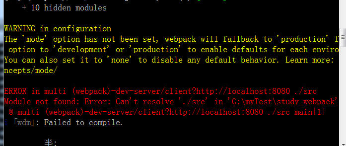

这个时候我们可以到package.json里面配置下

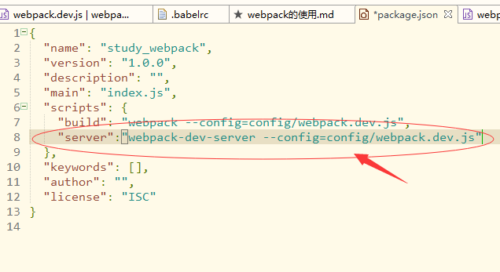

这个时候我们终端输入命令npm run server就可以跑起来了


然后我们再到项目dist文件夹下面的index.html 文件中引入打包的两个js，
保存后再到src文件下面分别给main.js和main2.js文件里面写一些东西。
```
main.js
	console.log("main");
main2.js
	console.log("main2");;
````

这个时候再再终端中输入命令 npm run server 然后再打开浏览器再地址栏输入 locahost:8888 就可以看到效果了，
注意这里的 locahost:9090 是之前你在下面这个文件配置的


2、开启本地服务并实现实时刷新浏览器效果

2.1 首先得在项目中安装webpack

在配置相关文件之前我们可以先来改变一下我们的目录结构
将dist文件夹下的index.html文件拖入src文件夹下。

```
npm install webpack -D

注意：-D 即 --save-dev
```

然后在webpack.deb.js里面进行如下配置

```
var webpack = require('webpack')
module.exports = {
   /*省略entry ,output等内容*/
    plugins:[
        new webpack.HotModuleReplacementPlugin()
    ],
	//配置webpack开发服务功能
	devServer:{
		//设置基本目录结构
		contentBase:path.resolve(__dirname,'../src'),
		//服务器的IP地址，可以使用IP也可以使用localhost
		host:'localhost',
		//服务端压缩是否开启
		compress:true,
		//配置服务端口号
		port:9090,
		//实现热更新和实时刷新浏览器
		inline:true,
        hot:true
	}
}
```

此时我们再次运行npm run server 的即可。当我们改变main.js或者main2.js的时候，浏览器会自动刷新。
那么如果我们需要css改变时也实时刷新，那该如何呢？只要我们进行如下配置即可


1、css文件打包

css文件打包需要有相应的css依赖文件style-loader和css-loader，
在DOS中输如下命令进行下载即可

```
npm install style-loader css-loader --save-dev
```


安装成功后我们先在src中新建css文件夹，并在css文件夹下新建index.css文件。

```
mkdir src\css

type nul>src\css\index.css
```

index.css文件内容如下：


然后需要在入口文件中引入该css文件

```js
main.js
	import css fromm './css/index.css'
```

现在在webpack.dev.js中对module属性中的diam进行配置

```js
module.exports = {
    /*省略entry ,output等内容*/
	//模块：定义css/js/html等打包规则
	module:{
		rules:[
			//css loader
			{
				test:/\.css$/,
				use:[
					{loader:"style-loader"},
					{loader:"css-loader"}
				]
			}
		]
	},
}
```

此时，我们已经把css打包环境配置好了，再次运行npm run server


打包成功后，打开浏览器，我们的css已经生效了。


当我们改变js文件或者css文件的时候，浏览器都会自动刷新。

**注意：**

此时我们再次进行npm run build 进行打包会报错，因此需要在项目中安装webpack-cli
```js
npm install webpack-cli --save-dev
```

此时我们再次进行npm run build 进行打包即可


## 五、常用插件的使用和配置

我们的项目在上线之前都需要对代码进行相应的压缩，下面我们来介绍一下常用的压缩代码插件

1、js的压缩和配置

js的压缩我们用uglifyjs-webpack-plugin插件

```js
npm install uglifyjs-webpack-plugin --save-dev
```


然后需要在webpack.dev.js中对改插件进行配置

```js
webpack.dev.js

	const uglify = require('uglifyjs-webpack-plugin');
	
	引入后在plugins配置里new一个 uglify对象就可以了
	
	plugins:[
		new uglify()
	]
```

这时候再DOS中运行npm run build进行打包即可。


2、打包HTML文件

HTML的压缩我们用html-webpack-plugin插件

```
npm install --save-dev html-webpack-plugin
```

下载完成后，我们需要在webpack.dev.js的plugins里面进行配置

```js
webpack.dev.js

const htmlPlugin = require('html-webpack-plugin');

new htmlPlugin({
	minify:{//对HTML进行压缩
		removeAttributeQuotes:true //removeAttrubuteQuotes是去掉属性的双引号。
	},
	hash:true, //为了开发中js有缓存效果，所以加入hash，这样可以有效避免缓存JS。
	template:'./src/index.html'//需要打包的HTML路径
})
```

运行npm run build，可以看到dist文件下已经生产一个index.html文件，且对应的js文件也已经帮我们自动引入了。


3、css中的图片处理

在处理图片之前，我们先在src文件夹下新建一个./img文件夹并在里面放置一张图片，
然后在index.html中设置一个类名为test的div元素，最后在index.css中设置这个元素的背景图片。


此时如果我们直接运行npm run server会报错


这里是因为我们缺少loader的解析,现在需要下载两个解析图片的loader  file-loader 和 url-loader

我们先来下载依赖

```
npm install file-loader url-loader --save-dev
```


